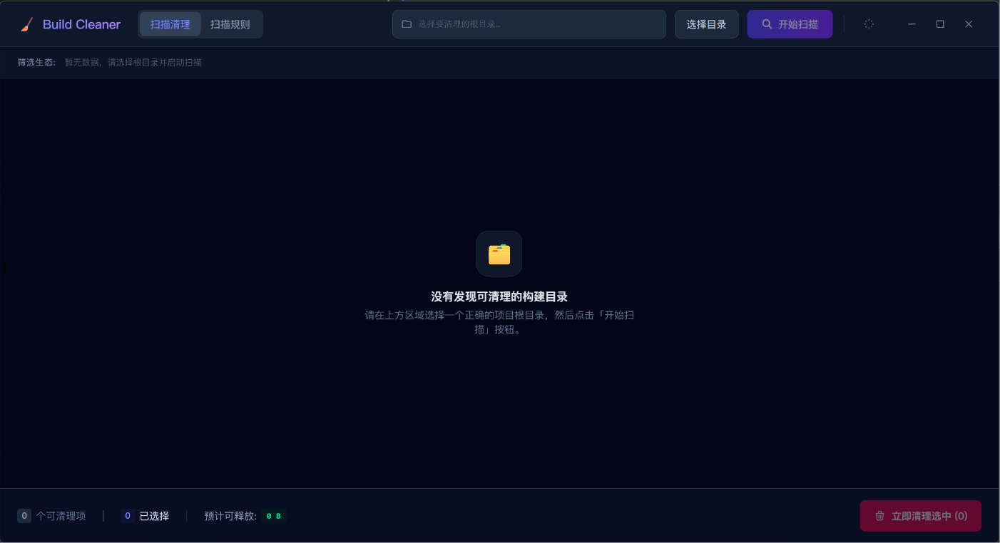
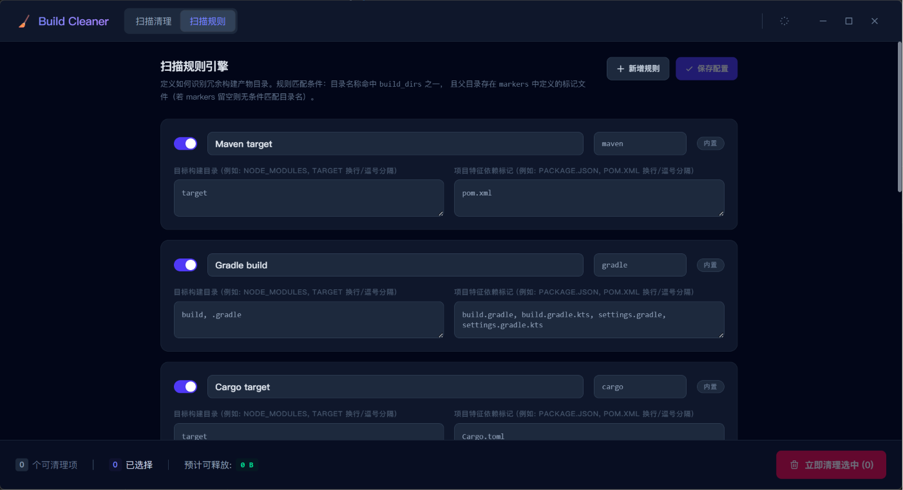

# Build Cleaner

A cross-platform desktop tool for reclaiming disk space by cleaning up build artifacts — Maven `target`, Gradle `build`, Cargo `target`, npm `node_modules`, .NET `bin`/`obj`, Python `__pycache__`, and more.

[中文版](README.zh-CN.md)

<p align="center">
  
  
</p>

## Features

- **Smart scanning** — Recursively scan any directory and automatically identify build artifacts using configurable rules
- **Rule-based matching** — Directory name matching combined with marker file verification (e.g., `pom.xml` for Maven targets)
- **Multi-ecosystem support** — Built-in presets for Maven, Gradle, Cargo, npm, .NET, Python, and CMake
- **Visual overview** — See path, ecosystem, size, file count, and matched rule at a glance
- **Batch operations** — Multi-select, select/deselect all, and filter by ecosystem with live statistics
- **Safe cleanup** — Confirmation dialog before deletion, with real-time progress during scan and clean
- **Custom rules** — Add, edit, enable/disable, or delete scan rules — changes persist across restarts
- **Dark mode** — One-click toggle, remembered across sessions

## Installation

Download the latest installer from [GitHub Releases](https://github.com/sodekim/build-cleaner/releases):

| Platform | Package | Notes |
| --- | --- | --- |
| Windows | `.msi` / `.exe` | `.msi` for system-wide install, `.exe` for portable use |
| macOS | `.dmg` | Drag to Applications. Use `aarch64` for Apple Silicon, `x64` for Intel |
| Linux | `.AppImage` / `.deb` | `.AppImage` runs directly; `.deb` for Debian/Ubuntu-based distros |

## Usage

1. **Pick a directory** — Click "Select Directory" and choose the root folder to scan
2. **Review results** — Build artifact directories appear in a sortable table with size and ecosystem info
3. **Filter** — Click ecosystem tags to narrow down by build system type
4. **Select** — Check the directories you want to remove; the footer shows total selected count and space to free
5. **Clean** — Click "Clean Selected", confirm, and watch the progress in real time
6. **Manage rules** — Switch to the "Rules" tab to customize scanning behavior

> [!TIP]
> Ecosystem filters are additive — click multiple tags to select build artifacts from several ecosystems at once before cleaning.

## Built-in Rules

| Ecosystem | Directory | Marker Files | Default |
| --- | --- | --- | --- |
| Maven | `target` | `pom.xml` | On |
| Gradle | `build`, `.gradle` | `build.gradle(.kts)`, `settings.gradle(.kts)` | On |
| Cargo | `target` | `Cargo.toml` | On |
| npm | `node_modules` | `package.json` | On |
| JS | `dist`, `build` | `package.json` | Off |
| .NET | `bin`, `obj` | `*.csproj`, `*.fsproj` | On |
| Python | `__pycache__`, `.pytest_cache`, `.mypy_cache` | — | On |
| CMake | `build` | `CMakeLists.txt` | Off |

## Tech Stack

| Layer | Technology |
| --- | --- |
| Desktop framework | [Tauri 2](https://tauri.app/) |
| Frontend | React 18, TypeScript, [Tailwind CSS v4](https://tailwindcss.com/), [daisyUI](https://daisyui.com/) |
| Backend | Rust (edition 2021), [tokio](https://tokio.rs/), [rayon](https://github.com/rayon-rs/rayon), [walkdir](https://crates.io/crates/walkdir) |
| Build tooling | Vite 6, [release-it](https://github.com/release-it/release-it) |

## Development

### Prerequisites

- [Node.js](https://nodejs.org/) 24+
- [pnpm](https://pnpm.io/) 11+
- [Rust](https://www.rust-lang.org/) 1.77+

### Setup

```bash
pnpm install
```

### Run in development mode

```bash
pnpm tauri:dev
```

This starts the Vite dev server and opens the Tauri window with hot-reload for both frontend and Rust code.

### Build for production

```bash
pnpm tauri:build
```

Installers are output to `src-tauri/target/release/bundle/`.

### Lint

```bash
pnpm lint
```

### Release

This project uses [release-it](https://github.com/release-it/release-it) with conventional commits:

```bash
pnpm release          # full release
pnpm release:dry      # dry run
```

Releases are automatically built and published by the [Build Installers](.github/workflows/build-installers.yml) workflow when a new GitHub Release is created.
